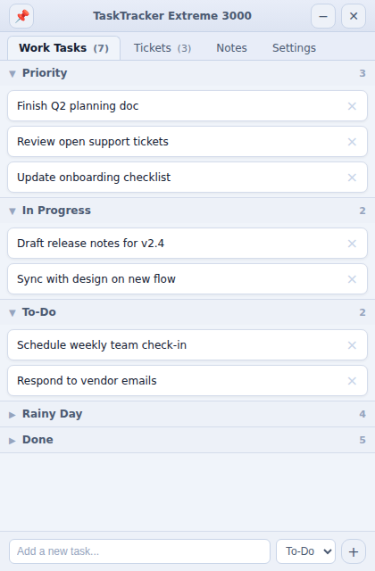

# TaskTracker Extreme 3000

A personal sidebar task manager for Windows and macOS with Desk365 helpdesk integration. Built for my own workflow. Outside usefulness is incidental, and no support, stability guarantees, or warranty of any kind is implied.

GitHub: [JohnKFisher/TaskTracker-Extreme-3000](https://github.com/JohnKFisher/TaskTracker-Extreme-3000)

---



---

## What This Is

A largely vibe-coded personal hobby app that lives on the edge of the screen and keeps tasks, notes, and support work visible without turning into a full desktop suite. Built with [Tauri v2](https://tauri.app) for a lightweight native shell and a plain HTML/CSS/JS renderer.

Windows is the primary UX tie-breaker. macOS is a supported target, but when platform conventions differ, Windows behavior wins unless explicitly documented otherwise.

## What It Does

**Task boards**
- Kanban-style Work Tasks board with columns: Standing (optional), Priority, In Progress, To-Do, Rainy Day, Done
- Optional Personal board with the same layout, shown per machine from Settings
- Drag-and-drop reordering within and between columns
- Right-click context menu to move tasks between columns
- Collapsed categories auto-expand when a task is added; Done stays collapsed if you want it that way
- Tab counts show only active (non-Done) tasks
- Task titles are auto-capitalized on entry

**Quick capture**
- Global shortcut (`Ctrl/Cmd+Shift+T`) to show or hide the sidebar
- Quick-add overlay (`Ctrl/Cmd+Shift+N`) to capture a task without switching windows

**Tickets**
- Desk365 ticket integration with secure API-key storage and periodic refresh
- New ticket "+" button opens the Desk365 create-ticket page directly
- Hide individual tickets from the list; hidden tickets are visually distinct when revealed

**Notes**
- Persistent scratch notes tab, shared across machines via sync folder

**Always-on-top**
- Pin button: dimmed when off, red when active — always visible at a glance

**Auto-update check**
- On startup, checks the GitHub releases API for a newer version
- If one exists, shows a clickable banner linking to the releases page; silent on network failure

**Settings**
- Appearance: Light / Dark / Auto theme, saved per machine
- Layout: toggle Personal tab and Standing column visibility, saved per machine
- Sync Folder: point to a cloud-synced folder to share tasks, notes, and Desk365 config between machines

## Data, Privacy, And Storage

All user data stays local unless you explicitly configure a sync folder pointing at your own cloud storage. There is no telemetry, analytics, or hidden network activity. The only outbound network calls are to your configured Desk365 account and the GitHub releases API for the version check.

When packaged, local data is stored in the OS app-data folder:
- **Windows:** `%AppData%\com.tasktracker.extreme3000\`
- **macOS:** `~/Library/Application Support/com.tasktracker.extreme3000/`

Shared-data files (synced if a sync folder is configured):
- `tasks.json`
- `notes.json`
- `config.json` (Desk365 hostname only — no secrets)
- `hidden-tickets.json`

Machine-specific files (never synced):
- `local-settings.json`
- `window-state.json`

Desk365 API keys are stored in the OS secure credential store, not in any JSON file. Desk365 ticket payloads are not stored in the shared folder — each machine fetches its own live tickets directly.

If a configured sync folder becomes unavailable, the app pauses shared-data access and shows a warning rather than silently writing somewhere else. Shared-folder changes are watched for near-immediate refresh, with a 5-minute reconciliation sweep as a fallback.

## First-Run Desk365 Setup

The Tickets tab will ask for:
- your Desk365 hostname — stored in `config.json` (e.g. `yourcompany.desk365.io`, no `https://` or path)
- your Desk365 API key — stored securely in the OS credential store

## Versioning

Version and build metadata comes from the checked-in `version.json` file.

```bash
npm run version:check   # verify tracked files match version.json
npm run version:sync    # sync tracked files from version.json
npm run version:bump    # bump patch version + build number
```

For a minor or major bump, edit `version.json` directly then run `npm run version:sync`.

## Getting Builds

GitHub Actions builds automatically in two ways:

- Every push to `main` creates downloadable workflow artifacts under **GitHub → Actions → (latest run) → Artifacts**
- Every push to `main` that changes `version.json` creates or updates a GitHub Release for that version

| Artifact | Platform |
|---|---|
| `tasktracker-extreme-3000-windows-portable-exe` | Windows portable EXE |
| `tasktracker-extreme-3000-macos-universal-dmg` | macOS universal DMG |

Release flow:
```bash
npm run version:bump   # or edit version.json manually for minor/major
git push origin main
```

> **Platform note:** macOS CI builds are ad-hoc signed but not notarized — you may need `System Settings → Privacy & Security → Open Anyway`. Windows builds are unsigned and may need `More info → Run anyway` on first launch.

## Building From Source

Requires [Rust](https://rustup.rs) and Node.js.

```bash
npm install
npm run version:check
npm run dev
```

For a production build:
```bash
npm run version:check
npm run build
```

## Limitations

- Requires a Desk365 account for ticket integration; task board and notes work without it
- Shared-data features depend on the configured sync folder remaining reachable
- Notes are one shared text blob — simultaneous edits on two machines require a manual retry after a conflict warning
- Tested primarily on the owner's own machines
